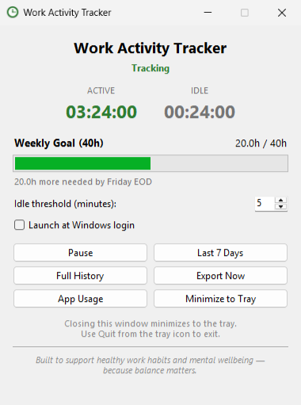
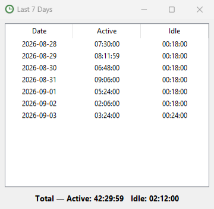
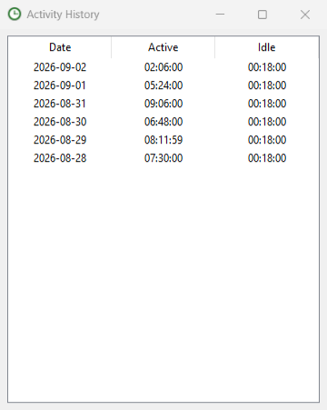
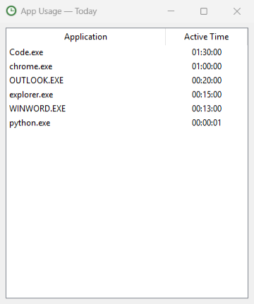

# Work Activity Tracker

A free, private **work activity tracker app for Windows**. It logs active and idle hours from
real mouse and keyboard use, tracks a weekly work-hour goal, and exports daily reports — with
no keystroke logging, no screenshots, and no cloud storage. Everything stays on your own machine.

Built to support healthy work habits and mental wellbeing — because balance matters, not surveillance.

## Download

Grab the latest build from the [Releases page](https://github.com/ca0777/Freeware-Work-Activity-Tracker/releases/latest) —
one `.exe` file, no installer, no account.

Windows may show a first-run SmartScreen warning since the build is unsigned — click
**More info → Run anyway**.

## Features

- **Active & idle detection** — reads Windows' own last-input signal (mouse or keyboard), nothing more
- **Configurable idle threshold** — a 1–60 minute grace period before time counts as idle
- **Weekly 40-hour goal** — tracks Monday–Friday against a 40-hour target, with hours remaining by Friday EOD
- **6 AM workday boundary** — a session that runs past midnight still logs under the day you started
- **Per-app usage** — see which application had focus while you were active
- **Automatic `.xlsx` export** — a spreadsheet per day, written on shutdown or on demand
- **Last 7 days & full history** views
- **Runs in the system tray** — closes to the tray, not gone; right-click for Show / Pause / Quit
- **Launch at Windows login** — optional, one checkbox

## Screenshots

<table>
<tr>
<td width="33%">

**Last 7 Days**

</td>
<td width="33%">

**Full History**

</td>
<td width="33%">

**App Usage**

</td>
</tr>
</table>

## Privacy

- No keystrokes are ever recorded — only *whether* there was recent input, never *which* key
- No screenshots or screen content are ever captured
- All data is stored locally, next to the app, as plain JSON and `.xlsx` files
- Nothing is uploaded anywhere — there is no server

## License

Freeware — free to download and use, at no cost, with no restrictions on personal use.
This is a closed-source release; the source code is not currently published.
